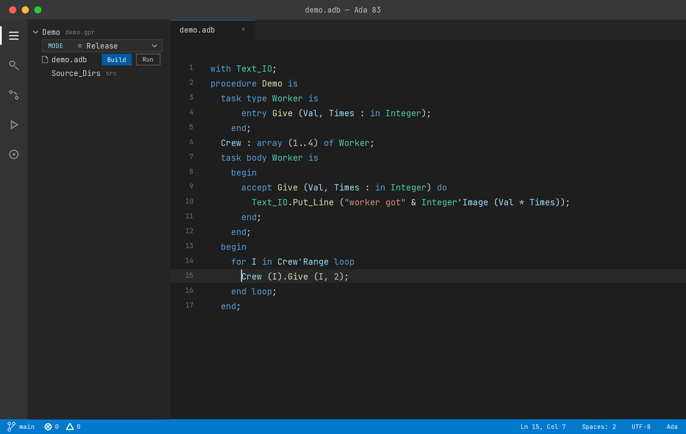
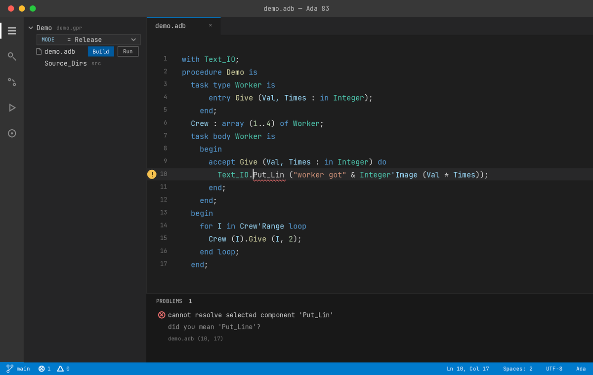
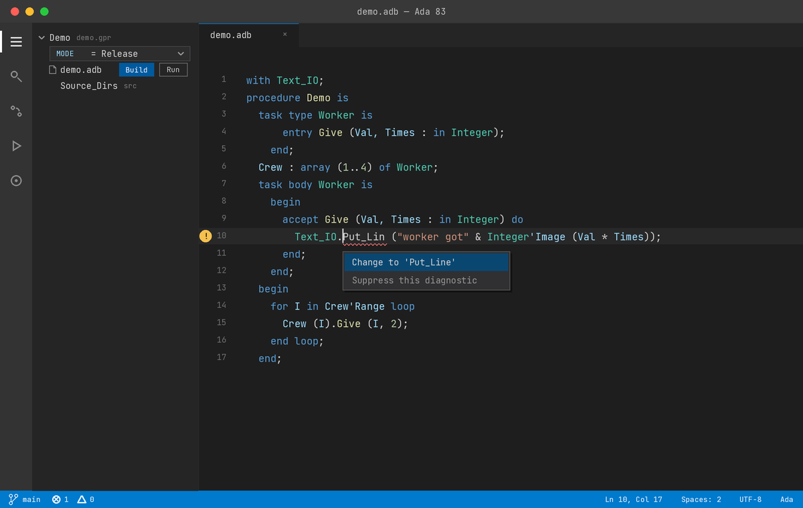
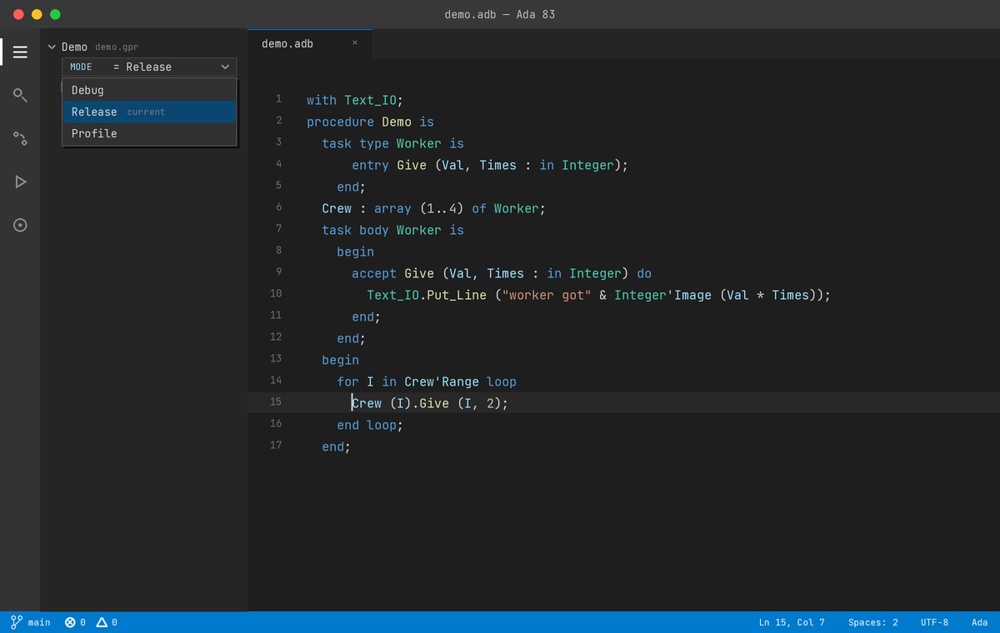
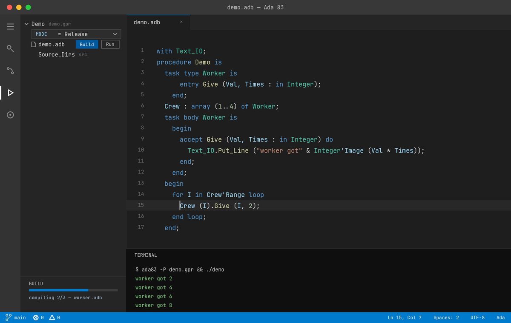
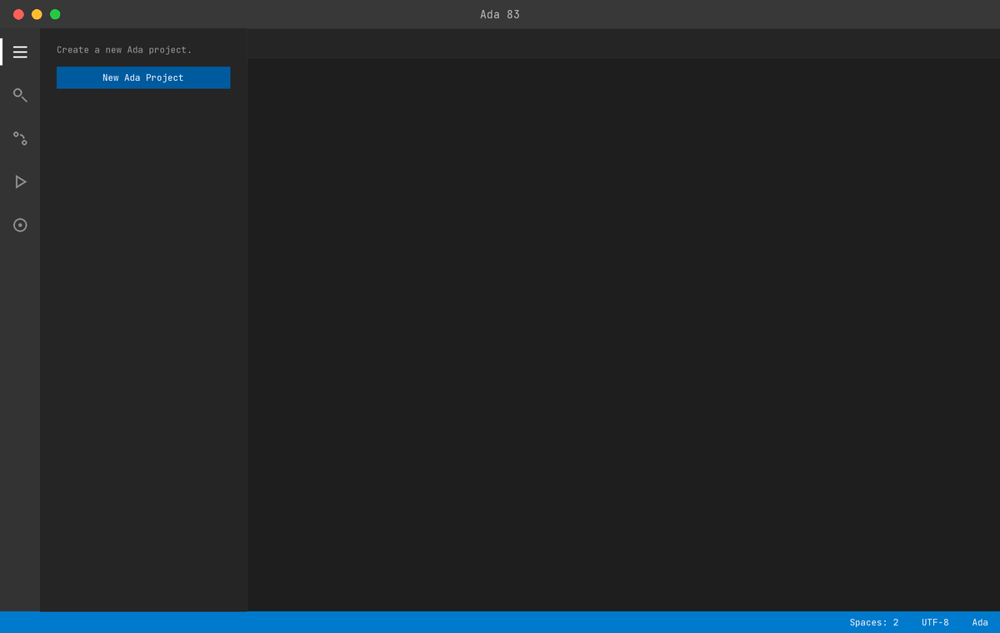
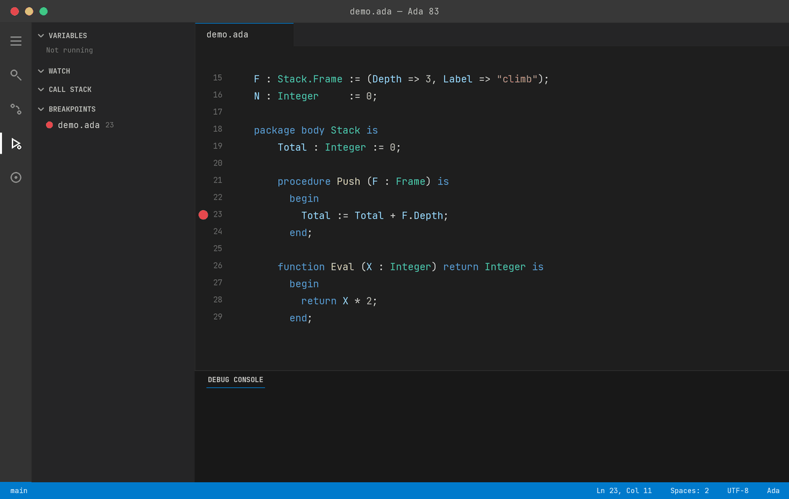

# Ada83 

[](https://github.com/AdaDoom3/Ada83/actions/workflows/ci-linux.yml)
[](https://github.com/AdaDoom3/Ada83/actions/workflows/ci-macos.yml)
[](https://github.com/AdaDoom3/Ada83/actions/workflows/ci-windows.yml)

A single-file Ada 83 LLVM compiler.



| | |
|---|---|
| Compiler | `ada83.c`, 95k lines, no generated code, no third-party source |
| Runtime | `ada83-runtime.ada`, 3k lines of Ada |
| Language | all of MIL-STD-1815A: tasking, generics, fixed point, representation clauses |
| Conformance | 3561 / 3561, ACATS 1.11 |
| Targets | Linux, macOS, Windows |

## Quick start

From the [latest release](https://github.com/AdaDoom3/Ada83/releases/latest),
unpack the archive for your platform: `bin-linux.zip`, `bin-macos.zip` or
`bin-windows.zip`

```ada
with Text_IO; use Text_IO;
procedure Hello is
  begin
    Put_Line ("Hello, Ada world!");
  end;
```

```
$ ./ada83 hello.ada -o hello
Compiled 'hello.ada' -> 'hello.native.ll'
Generated ALI file 'hello.native.ali'
$ ./hello
Hello, Ada 83!
```

For the editor, install the extension that came in the same archive:

```sh
code --install-extension ada83.vsix
```

It needs `ada83` on your PATH, or `ada83.compilerPath` set to where you
unpacked it.

## Building

| Platform | Command | Notes |
| -------- | ------- | ----- |
| Linux    | `make`  | GCC or Clang; installs libLLVM via the system package manager if absent |
| macOS    | `make.applescript` | Apple Clang; libLLVM via Homebrew |
| Windows  | `make.bat` | GCC or Clang; offers to fetch Zig if neither is installed |

Every script writes what it builds into `bin-<target>/` - `bin-linux/ada83`,
`bin-macos/ada83`, `bin-windows\ada83.exe` with the DLLs it loads beside it.
The DLLs are vendored in `bin-libraries.zip`, which holds nothing else; the
release workflow zips each finished `bin-<target>/` into the archives it
publishes.

`ada83-runtime.ada` holds the standard library, and the compiler looks for it
beside its own executable.

| Platform | Command | Produces |
| -------- | ------- | -------- |
| Linux    | `make package` | `bin-linux/`, extension and artwork included |
| macOS    | `osascript make.applescript package` | `bin-macos/`, both slices together |
| Windows  | `make.bat package` | `bin-windows/`, DLLs included |

## Conformance

Under ACATS 1.11 all 3561 tests pass

| Suite | Category | Passed | Completion |
|:-----:|----------|-------:|-----------:|
| **A** | Acceptance | `140 / 140` | **100%** ✅ |
| **B** | Illegality | `1350 / 1350` | **100%** ✅ |
| **C** | Executable | `1973 / 1973` | **100%** ✅ |
| **D** | Numerics | `17 / 17` | **100%** ✅ |
| **E** | Inspection | `34 / 34` | **100%** ✅ |
| **L** | Post-compilation | `47 / 47` | **100%** ✅ |
| | **Total** | **`3561 / 3561`** | **100%** ✅ |

## Benchmarks

Run time of the generated code at `-O2`, against GNAT 13.3.0 (GCC
`13.3.0-6ubuntu2~24.04.1`), on Linux x86_64 with 4 cpus (Intel Xeon @ 2.80 GHz).
Median ± MAD of 25 interleaved repetitions per program, pinned, after warmup;
the whole run is measured twice and a ratio is printed only where both suites
could tell the compilers apart and agreed with each other (raw data:
`bench/runs-2026-09-19-b/`).

| Program | Stresses | ada83 (s) | gnat (s) | Ratio | Result |
|---------|----------|----------:|---------:|------:|-------:|
| **lu** | LU decomposition, float division | `0.062 ± 0.001` | `0.220 ± 0.002` | `0.28` | **3.5× faster** |
| **memory** | allocation and deallocation | `0.116 ± 0.000` | `0.248 ± 0.002` | `0.47` | **2.1× faster** |
| **taskelse** | selective wait with an else part | `0.042 ± 0.001` | `0.088 ± 0.001` | `0.48` | **2.1× faster** |
| **finalizer** | controlled types, finalisation on scope exit | `0.025 ± 0.000` | `0.050 ± 0.000` | `0.50` | **2.0× faster** |
| **indirect** | calls through a subprogram pointer | `0.059 ± 0.001` | `0.097 ± 0.000` | `0.61` | **1.6× faster** |
| **taskflood** | task creation and termination | `0.385 ± 0.002` | `0.499 ± 0.002` | `0.77` | **1.3× faster** |
| **strings** | slices and character work | `0.043 ± 0.000` | `0.052 ± 0.000` | `0.83` | **1.2× faster** |
| **wraparound** | modular arithmetic at the type's top | `0.054 ± 0.000` | `0.064 ± 0.000` | `0.84` | **1.2× faster** |
| **checks** | range and index checks in a hot loop | `0.159 ± 0.000` | `0.184 ± 0.000` | `0.86` | **1.2× faster** |
| **numerics** | fixed point and 12-digit float \* | `0.070 ± 0.000` | `0.081 ± 0.000` | `0.86` | **1.2× faster** |

Rerun the table with `bash test.sh bench codegen`; the harness refuses to
measure above a load average of 2, and refusing is the point.

## VSCode Extension

`ada83 --lsp` serves the Language Server Protocol on stdin and stdout, so
hovers, completions and diagnostics come from the same code that passes
ACATS. The extension finds the compiler on your PATH — or fetches the
latest release on its own.

| | |
|:--:|:--:|
|  |  |
| The compiler's diagnostics, notes included | Quick fixes built from its own suggestions |
|  |  |
| GPR scenario variables switch from the sidebar | Build, watch progress, run in the terminal |

Build and run the project without leaving the editor — the sidebar reads
`.gpr` and `.gpj` project files, tracks build progress unit by unit, and
runs the result in the integrated terminal.

**Ada 83: New Project** scaffolds a buildable project from one name —
a `.gpr` with a typed scenario variable, a `src/` directory, and a main
that prints a line:



Error messages can be read in another language. `ada83.language` picks one,
and anything but English hands the message to the editor's model.

| `ada83.language` | |
| ---------------- | --- |
| `en` | English, as the compiler writes it — no model, no request |
| `es` | Spanish |
| `fr` | French |
| `de` | German |
| `zh-CN` | Chinese (Simplified) |
| `ja` | Japanese |
| `hi` | Hindi |
| `lolcat` | `O NOES 'Put_Lin' IS NOT CALLABUL. SRSLY.` |

| Setting | |
| ------- | --- |
| `ada83.compilerPath` | Location of `ada83` and where `${workspaceFolder}` gets substituted |
| `ada83.includePaths` | Directories for with-ed units |
| `ada83.language` | Language error messages are read in |
| `ada83.formatOnType` | Reindent each line as you type it |
| `ada83.formatOnSave` | Reformat the whole file as it is saved, by asking a model |
| `ada83.formatStrength` | How much a reformat may change: `indentation`, `layout` or `style` |
| `ada83.trace.server` | Write the protocol traffic to the output channel |

## Use

The compiler emits LLVM IR, so the IR can be taken directly:

```sh
./ada83 --ir hello.ada -o hello.ll      # Textual LLVM IR
./ada83 --emit-llvm hello.ada -o hello  # Native, keeping the optimised IR
./ada83 --ir a.ada b.ada c.ada          # Several units, one process each
./ada83 hello.ll world.ll -o hello      # Link .ll modules, no source needed
lli hello.ll                            # Interpret the IR
```

## Debugging

`-g` builds a binary every LLVM tool reads — lldb, lldb-dap — and `-ggdb`
targets gdb's Ada mode instead; either defaults the build to `-O0` unless
an explicit `-O` is given.

```sh
./ada83 -g hello.ada -o hello     # Debug info for lldb, lldb-dap, any LLVM tool
./ada83 -ggdb hello.ada -o hello  # Debug info for gdb's Ada mode
./ada83 --debug hello             # Debug in the terminal: ada83 drives lldb-dap
```

In the editor, `F5` runs `ada83 --dap` — the compiler is its own Debug
Adapter Protocol server, lldb-dap underneath — for breakpoints, stepping,
variables and Ada-spelled expressions; names are translated on the way
through, and a Tasks view lists the program's Ada tasks while it is
stopped. `--debug` is the same engine and the same translation in the
terminal.



### In the terminal

```
$ ./ada83 --debug demo
(ada83) break demo.stack.push
Breakpoint 1 at demo.ada:23
(ada83) run
Stopped at demo.stack.push, demo.ada:23
   23            Total := Total + F.Depth;
(ada83) bt
#0  demo.stack.push  demo.ada:23
#1  demo             demo.ada:47
(ada83) print F.Label
"climb"
```

Breakpoints take a dotted name or `file:line`; the rest of the commands
are gdb's — `run`, `continue`, `next`, `step`, `finish`, `bt`, `print`,
`frame`, `threads`, `delete`, `quit` — with their usual single letters.
Task threads are listed under their Ada names.

### In gdb and lldb

The same binaries debug in stock tools. `-g` is plain DWARF, so any LLVM
tool reads it:

```
$ lldb demo
(lldb) b demo.ada:23
(lldb) frame variable f
(frame) f = (depth = 3, label = "climb")
```

`-ggdb` carries the Ada language tag instead, which switches gdb into its
Ada mode — aggregates, attributes, and breaks by qualified name:

```
$ gdb demo
(gdb) break demo.stack.push
(gdb) print f
$1 = (depth => 3, label => "climb")
```

## Tests

The ACATS tests are in `tests.zip` and unzipped on first use. The
reproducers under `repro/` — the program each fix was landed with, 400 of
them — are a suite of their own, run at the end of every full run and on
their own in about thirty seconds.

```sh
bash test.sh         # Every class, the default
bash test.sh run c   # One class
bash test.sh run c45 # One group
bash test.sh check   # Run, then diff against the baseline
bash test.sh repro   # The reproducers, judged by the headers in each file
bash test.sh help
```

## Release Workflow

1. Update `ada83.c` with `ADA83_VERSION_MINOR` or `ADA83_VERSION_MAJOR` through a normal PR and merge to main.
2. Update git with `git tag v1.0 && git push origin v1.0`
3. Allow `release.yml` to verify the tag, build and packages all platforms and publishes.

The tag gate refuses to publish unless the tag matches `ADA83_VERSION_*` and no release exists under that tag. So a tag on an unmerged branch, or one that disagrees.
